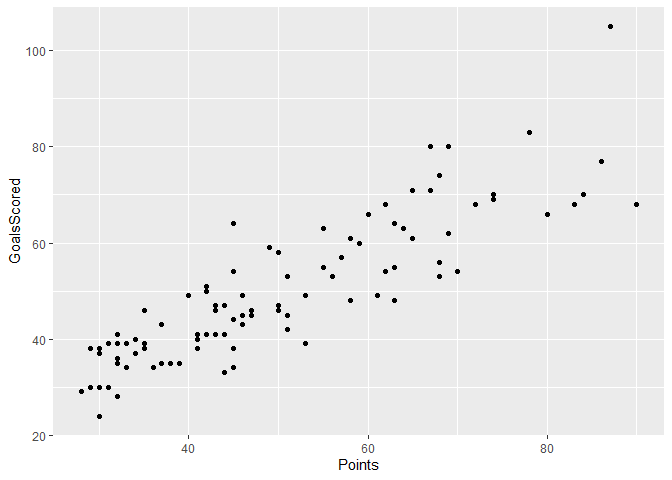

Vamos a analizar la correlación entre el la variable puntos(Points) y la
variable goles marcados(GoalsScored) del paquete *eurosoccer*.

Para acceder a los datos escribimos en R:

``` r
#instalar el paquete WRS2
#install.packages("WRS2")
```

``` r
#activar el paquete WRS2
library(WRS2)
```

``` r
#activar los datos
data(eurosoccer)
```

## Visualice la relación entre las dos variables.

Para realizar un diagrama de dispersión entre las dos variables, vamos a
utilizar la función ggplot del paquete ggplot2. Nuevamente, realizamos
la instalación (si fuera necesario) y la activación del paquete antes de
utilizarlo.

``` r
#Instalar el paquete en caso de que aún no lo tengan
#install.packages("ggplot2")
```

``` r
# activar el paquete
library(ggplot2)
```

Ahora estamos listos para realizar el diagrama de dispersión. En la
función ggplot debemos indicar dónde se encuentran los datos (en el
objeto eurosoccer) y con el argumento estético aes le indicamos cuál
variable irá en el eje x y cuál en el eje y. Luego agregamos la función
geom_point para que incluya la nube de puntos.

<!-- -->

Vemos que la relación es positiva o directa y bastante lineal. No parece
haber *outliers* llamativos.

## Calcule el coeficiente de correlación pertinente.

Tenemos suficientes datos y la relación es bastante lineal, por lo cual
tendría sentido analizar la correlación lineal de Pearson:

``` r
#Correlaciones de Pearson entre Points-GoalsScored.
cor(x = eurosoccer$Points,
y = eurosoccer$GoalsScored)
```

    ## [1] 0.8713148

Obtenemos que las variables se relacionan de manera positiva y fuerte,
con r ≈ .87

Si quisiéramos calcular el coeficiente de correlación de Spearman, que
se ve menos afectado por los posibles outliers, haríamos lo siguiente:

``` r
#Correlaciones de Spearman entre Points-GoalsScored.
cor(x = eurosoccer$Points,
y = eurosoccer$GoalsScored, 
method = "spearman")
```

    ## [1] 0.8805386

## Realice una prueba de hipótesis para saber si la correlación es significativa. Compruebe los supuestos.

También podemos realizar una prueba de hipótesis para saber si la
correlación es significativa (significativamente distinta de cero). Si
optamos por el coeficiente de correlación de Pearson debemos primero
comprobar el supuesto de normalidad con la prueba de Shapiro Wilks.

``` r
#Prueba de Normalidad de Points
shapiro.test(eurosoccer$Points)
```

    ## 
    ##  Shapiro-Wilk normality test
    ## 
    ## data:  eurosoccer$Points
    ## W = 0.94268, p-value = 0.000382

``` r
#Prueba de Normalidad de GoalsScored
shapiro.test(eurosoccer$Points)
```

    ## 
    ##  Shapiro-Wilk normality test
    ## 
    ## data:  eurosoccer$Points
    ## W = 0.94268, p-value = 0.000382

Para un nivel de confianza del 95% (p-valor \> .05), podemos afirmar que
ninguna de las dos variables sigue una distribución normal. Por lo
tanto, si queremos realizar la prueba de hipótesis de la correlación
debemos utilizar el coeficiente de correlación de Spearman.

``` r
#Prueba de hipótesis: Spearman.
cor.test(x = eurosoccer$Points,
y = eurosoccer$GoalsScored, 
method = "spearman")
```

    ## Warning in cor.test.default(x = eurosoccer$Points, y = eurosoccer$GoalsScored, :
    ## Cannot compute exact p-value with ties

    ## 
    ##  Spearman's rank correlation rho
    ## 
    ## data:  eurosoccer$Points and eurosoccer$GoalsScored
    ## S = 17613, p-value < 2.2e-16
    ## alternative hypothesis: true rho is not equal to 0
    ## sample estimates:
    ##       rho 
    ## 0.8805386

Existe una correlación fuerte (rho ≈ .88) y significativa (p-valor \<
.001) entre los goles marcados y los puntos.

## Calcule la potencia estadística actual.

Para calcular con qué confianza podemos afirmar nuestras conclusiones,
vamos a calcular la potencia estadística del estudio. Para ello
utilizamos la función pwr.r.test del paquete pwr.

``` r
#install.packages("pwr")
```

Activamos el paquete.

``` r
#activamos el paquete pwr
library(pwr)
```

Le indicamos a la función pwr.r.test la información que tenemos.

``` r
# calculamos la potencia estadística del estudio
pwr.r.test(n = 96, #el número de observaciones que tenemos
r = 0.8805386, #la estimación de la correlación que tenemos
sig.level = .05, #el nivel de confianza con el que trabajamos 5%
power = NULL) #este es el valor que estimará, por eso lo dejamos en NULL
```

    ## 
    ##      approximate correlation power calculation (arctangh transformation) 
    ## 
    ##               n = 96
    ##               r = 0.8805386
    ##       sig.level = 0.05
    ##           power = 1
    ##     alternative = two.sided

La potencia estadística estimada es del 100% con lo cual tenemos
confianza en que la correlación entre Points y GoalsScored es
significativa.

## Evalúe la correlación parcial entre Points y GoalsScored según la tercera variable goles de diferencia (GoalDifference).

Por último, para evaluar si la relación entre los puntos(Points)) y los
goles marcados(GoalsScored) se ve perturbada por los goles de
diferencia(GoalDifference), vamos a realizar una correlación parcial. En
este caso queremos ver la correlación entre Points y GoalsScored,
controlando el efecto de GoalDifference.

Para ello, utilizamos la función pcor.test del paquete ppcor.

``` r
#instalamos el paquete ppcor si lo necesitamos
#install.packages("ppcor")
```

Activamos el paquete y los datos, ya que la función pcor.test no incluye
el argumento data para indicarle dónde se encuentran las variables a
analizar.

``` r
#activamos el paquete ppcor
library(ppcor)
#activamos las variables
attach(eurosoccer)
```

    ## The following objects are masked from eurosoccer (pos = 3):
    ## 
    ##     Games, GoalDifference, GoalsConceded, GoalsGame, GoalsScored,
    ##     League, Lost, Points, Team, Tied, Won

    ## The following objects are masked from eurosoccer (pos = 4):
    ## 
    ##     Games, GoalDifference, GoalsConceded, GoalsGame, GoalsScored,
    ##     League, Lost, Points, Team, Tied, Won

En la función pcor.test indicamos con x e y las variables para las que
vamos a analizar la correlación y con z la variable que vamos a
controlar. Además, como hemos visto que la correlación de Spearman es
más adecuada en este caso, le especificamos el método con el que
queremos que trabaje.

``` r
# calculamos la correlación parcial entre Points y GoalsScored, controlando GoalDifference
pcor.test(x = Points,
y = GoalsScored,
z = GoalDifference,
method = "spearman")
```

    ##    estimate     p.value statistic  n gp   Method
    ## 1 0.3031189 0.002827357   3.06749 96  1 spearman

Obtenemos que la correlación parcial entre los puntos(Points) y los
goles marcados(GoalsScored) permanece significativa (p-valor \< .05)
cuando controlamos el efecto de los goles de diferencia(GoalDifference)
pero su valor disminuye drásticamente hasta rs ≈ .3. Obtenemos en
notación APA: S(93) ≈ 3.067, p \< .01, rs ≈ 0.3, donde los grados de
libertad se calculan como n-2-k, con k=1 por tratarse de una correlación
parcial.

En definitiva, existe una relación significativa pero débil entre Points
y GoalsScored; la variable GoalDifference también tiene un rol
importante en la determinación de los puntos.
