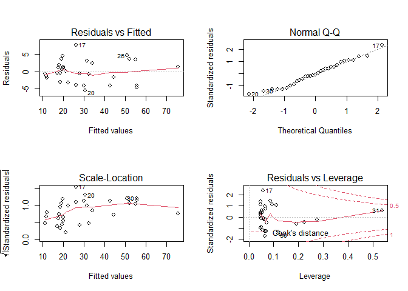

Utilizaremos los datos “trees”. Se trata de un conjunto de datos que
consta de 31 observaciones sobre mediciones de la circunferencia, altura
y volumen de la madera sobre cerezos negros talados:

-   Girth: Diámetro en pulgadas del árbol.
-   Height: Altura en pies del árbol.
-   Volume: Volumen de la madera en pies cúbicos.

Para acceder a los datos escribimos en R:

``` r
# Activamos los datos
data(trees)
```

Se desea realizar un modelo de regresión que estime el volumen (Volume)
en función de la circunferencia del árbol (Girth), para ello:

## Realice un análisis exploratorio y visualice la relación entre las dos variables.

Comenzamos describiendo la relación entre las variables Volume y Girth.

``` r
# Exploramos las primeras 6 observaciones
head(trees)
```

    ##   Girth Height Volume
    ## 1   8.3     70   10.3
    ## 2   8.6     65   10.3
    ## 3   8.8     63   10.2
    ## 4  10.5     72   16.4
    ## 5  10.7     81   18.8
    ## 6  10.8     83   19.7

``` r
# Obtenemos las dimensiones
dim(trees)
```

    ## [1] 31  3

Realizamos el diagrama de dispersión entre las variables.

``` r
# Activamos el paquete para realizar el diagrama de dispersión
library(ggplot2)

# Diagrama de dispersión entre Volume y Girth
ggplot(data = trees, aes(x = Girth,y = Volume)) + geom_point()
```


Vemos que tiene sentido ajustar un modelo de regresión lineal simple
dado que la relación es bastante lineal.

## Realice un modelo de regresión simple por medio de la función lm(). Interprete la bondad de ajuste y calcule la tasa de error.

Ajustamos un modelo de regresión simple por medio de la función lm()
indicáncole los datos (data) y cuál será la variable respuesta (Volume)
y cuál la variable explicativa (Girth). Generamos un objeto llamado
model_rm donde se guardan los resultados del modelo.

``` r
# Modelo de Regresión Lineal Simple para Volume en función de Girth
model_rm <- lm(Volume ~ Girth, data = trees)
```

Obtenemos el resumen modelo con la función summary().

``` r
# Resumen modelo Volume ~ Girth:
summary(model_rm)
```

    ## 
    ## Call:
    ## lm(formula = Volume ~ Girth, data = trees)
    ## 
    ## Residuals:
    ##    Min     1Q Median     3Q    Max 
    ## -8.065 -3.107  0.152  3.495  9.587 
    ## 
    ## Coefficients:
    ##             Estimate Std. Error t value Pr(>|t|)    
    ## (Intercept) -36.9435     3.3651  -10.98 7.62e-12 ***
    ## Girth         5.0659     0.2474   20.48  < 2e-16 ***
    ## ---
    ## Signif. codes:  0 '***' 0.001 '**' 0.01 '*' 0.05 '.' 0.1 ' ' 1
    ## 
    ## Residual standard error: 4.252 on 29 degrees of freedom
    ## Multiple R-squared:  0.9353, Adjusted R-squared:  0.9331 
    ## F-statistic: 419.4 on 1 and 29 DF,  p-value: < 2.2e-16

Al final de la tabla se observan los estadísticos de bondad de ajuste.
Tenemos:

-   Un error estándar residual RSE = 4.252, es decir el error de las
    estimaciones es de 4.252 pies cúbicos.
-   Un coeficiente de determinación R2 = 93.5%, por lo que nuestro
    modelo explica casi toda la variabilidad en el volumen de madera.
-   Obtenemos la prueba F de significación global del modelo F(1,29) =
    419.4,p \< .001, con lo cual decimos que este modelo explica/predice
    el volumen de madera (Volume) significativamente mejor que el
    volumen medio en las observaciones. Este modelo es significativo.

Calculamos la tasa de error como el valor de RSE que hemos visto antes
dividido el valor medio de la respuesta, así:

``` r
sigma(model_rm)/mean(trees$Volume)
```

    ## [1] 0.1409298

Con lo cual decimos que la tasa de error de nuestro modelo es del
14.09%.

## Interprete los coeficientes de regresión del modelo.

Esta es la tabla de coeficientes del modelo:

``` r
summary(model_rm)$coefficients
```

    ##               Estimate Std. Error   t value     Pr(>|t|)
    ## (Intercept) -36.943459   3.365145 -10.97827 7.621449e-12
    ## Girth         5.065856   0.247377  20.47829 8.644334e-19

-   El intercepto vale β0 = −36.943459, en este caso no tiene sentido
    debido a que sería el volumen de madera de un cerezo de un diámetro
    de cero pulgadas. (algo irreal). Podríamos centrar el predictor para
    que pasara a interpretarse como el volumen de madera de un cerezo de
    un diámetro medio.
-   La pendiente vale β1 = 5.065856, lo cual quiere decir que por cada
    pulgada más de diámetro, el volumen de madera del árbol es 5.065856
    pies cúbicos más.

Ambos coeficientes son significativos (significativamente distintos de
cero).

Para mostrar la ecuación del modelo final automatizando los coeficientes
en la generación del informe, podemos usar el paquete ‘equatiomatic’:

``` r
# Instalamos en paquete 'equatiomatic' en caso de no tenerlo instalado aún
#install.packages('equatiomatic')

# Activamos el paquete
library(equatiomatic)

# Mostramos la ecuación del modelo
extract_eq(model_rm, wrap = TRUE, use_coefs = TRUE)
```

$$
\\begin{aligned}
\\operatorname{\\widehat{Volume}} &= -36.94 + 5.07(\\operatorname{Girth})
\\end{aligned}
$$

Podemos mostrar también la línea del modelo y su intervalo de confianza,
superpuesta a las observaciones.

``` r
ggplot(trees, aes(x = Girth, y = Volume)) + 
  geom_point() +
  stat_smooth(method = "lm", col = "red")
```

    ## `geom_smooth()` using formula 'y ~ x'


## Obtenga los intervalos de confianza de los coeficientes de regresión.

Para obtener los intervalos de confianza de los coeficientes,
escribimos:

``` r
confint(model_rm)
```

    ##                  2.5 %     97.5 %
    ## (Intercept) -43.825953 -30.060965
    ## Girth         4.559914   5.571799

Con un 95% de confianza podemos decir que, en la población, el
intercepto tomará un valor entre \[-43.825953 , -30.060965\] y la
pendiente en \[4.559914 , 5.571799\].

## Evalúe los supuestos del modelo.

### Supuesto de linealidad.

Para evaluar los supuestos de linealidad del modelo realizamos los
gráficos diagnósticos de los residuos.

``` r
# Diagnóstico del modelo: Volume ~ Girth
par(mfrow = c(2,2))
plot(model_rm)
```


Podemos observar en los gráficos:

1.  ‘Residuals vs Fitted’. Los residuos aumentan algo en los extremos
    del rango de valores ajustados (línea roja) por lo que no se
    cumpliría el supuesto de homogeneidad de varianza (u
    Homocedásticidad).

2.  ‘Normal Q-Q’. Los residuos parecen seguir una distribución normal,
    las colas no se apartan demasiado de la diagonal. Lo podemos
    comprobar con la prueba de Shapiro-Wilk.

``` r
# Prueba de normalidad de los residuos del modelo
shapiro.test(model_rm$residuals)
```

    ## 
    ##  Shapiro-Wilk normality test
    ## 
    ## data:  model_rm$residuals
    ## W = 0.97889, p-value = 0.7811

Comprobamos que el p-valor \> 0.05. No podemos decir que los datos no se
ajusten a una distribución normal.

1.  ‘Scale-Location’. Podemos observar que el mismo patrón que en el
    ‘gráfico 1’ también se produce en este con los residuos
    estandarizados.

2.  ‘Residuals vs Leverage’. Aunque el valor absoluto de los residuos
    estandarizados es menor que 3, llama la atención que la observación
    de mayor diámetro supere la línea de 0.5 de la distancia de Cook.

Dado que se observa que este modelo tiende a subestimar el volumen de
madera dados diámetros pequeños o grandes y a sobreestimarlo dados
diámetros intermedios y que el volumen es una magnitud superior en dos
órdenes al diámetro, podría tener sentido utilizar otro modelo de ajuste
que incluyera el segundo grado del diámetro.

``` r
model_rm2 <- lm(Volume ~ Girth + I(Girth^2), data = trees)

summary(model_rm2)
```

    ## 
    ## Call:
    ## lm(formula = Volume ~ Girth + I(Girth^2), data = trees)
    ## 
    ## Residuals:
    ##     Min      1Q  Median      3Q     Max 
    ## -5.4889 -2.4293 -0.3718  2.0764  7.6447 
    ## 
    ## Coefficients:
    ##             Estimate Std. Error t value Pr(>|t|)    
    ## (Intercept) 10.78627   11.22282   0.961 0.344728    
    ## Girth       -2.09214    1.64734  -1.270 0.214534    
    ## I(Girth^2)   0.25454    0.05817   4.376 0.000152 ***
    ## ---
    ## Signif. codes:  0 '***' 0.001 '**' 0.01 '*' 0.05 '.' 0.1 ' ' 1
    ## 
    ## Residual standard error: 3.335 on 28 degrees of freedom
    ## Multiple R-squared:  0.9616, Adjusted R-squared:  0.9588 
    ## F-statistic: 350.5 on 2 and 28 DF,  p-value: < 2.2e-16

``` r
extract_eq(model_rm2, wrap = TRUE, use_coefs = TRUE)
```

$$
\\begin{aligned}
\\operatorname{\\widehat{Volume}} &= 10.79 - 2.09(\\operatorname{Girth}) + 0.25(\\operatorname{Girth\\texttt{^}2})
\\end{aligned}
$$

``` r
# Diagnóstico del modelo2: Volume ~ Girth
par(mfrow = c(2,2))
plot(model_rm2)
```



Con este modelo sí parece haber homocedasticidad en los residuos, por lo
que se cumpliría este supuesto y sí sería un modelo válido, atendiendo a
que también se mantiene la normalidad de los residuos y que todos entran
en la distancia de Cook de 0.5.

### Supuesto de independencia de las observaciones

Si las observaciones del conjunto de datos estuviesen ordenadas,
podríamos medir el grado de correlación entre las mismas debido al
proceso de toma de datos, mediante, por ejemplo, la prueba de
Durbin-Watson, del paquete ‘car’.

``` r
# Instalamos en paquete 'car' en caso de no tenerlo instalado aún
#install.packages('car')

# Activamos el paquete 'car'
library(car)
```

    ## Loading required package: carData

``` r
durbinWatsonTest(model_rm)
```

    ##  lag Autocorrelation D-W Statistic p-value
    ##    1       0.1679948      1.437206   0.058
    ##  Alternative hypothesis: rho != 0

En casi todas las veces que se ejecuta este test, el p-valor del
‘bootstrap’ es \> .05 por lo que asumimos que los datos no presentan
autocorrelación.

## Obtenga la potencia estadística del modelo.

Para estimar la potencia estadística del modelo de regresión lineal
utilizamos los resultados de la prueba F (o tabla ANOVA) y la función
*pwr.f2.test* del paquete pwr.

``` r
# Activamos el paquete 'pwr'
library(pwr)
```

Para el modelo de grado 1:

``` r
pwr.f2.test(u = 1, #grados de libertad del numerador en la prueba F.
v = 29, #grados de libertad del denominador en la prueba F.
f2 = .935/(1-.935), #tamaño del efecto estimado
sig.level = 0.05, #nivel de significación asumido
power = NULL) #potencia estadística, queda con NULL para que se estime
```

    ## 
    ##      Multiple regression power calculation 
    ## 
    ##               u = 1
    ##               v = 29
    ##              f2 = 14.38462
    ##       sig.level = 0.05
    ##           power = 1

Para el modelo de grado 2:

``` r
pwr.f2.test(u = 2, #grados de libertad del numerador en la prueba F.
v = 28, #grados de libertad del denominador en la prueba F.
f2 = .962/(1-.962), #tamaño del efecto estimado
sig.level = 0.05, #nivel de significación asumido
power = NULL) #potencia estadística, queda con NULL para que se estime
```

    ## 
    ##      Multiple regression power calculation 
    ## 
    ##               u = 2
    ##               v = 28
    ##              f2 = 25.31579
    ##       sig.level = 0.05
    ##           power = 1

El valor de potencia estadística estimada es del 100%, es decir, podemos
estar seguros de que nuestro modelo es significativo.

## Realice una predicción del volumen cuando el diámetro es de 10.6, 8.2, 11 y 20 pulgadas.

La función genérica predict() del paquete stats (instalado por defecto
en R) permite hacer predicciones con nuestro modelo, a partir de nuevos
valores para nuestra variable explicativa.

Para indicarle a la función los valores de la variable explicativa para
los cuales queremos estimar la variable respuesta, debemos crear un data
frame que contenga los nuevos valores que queremos evaluar.

Entonces en este caso escribimos:

``` r
new <- data.frame(Girth= c(10.6, 8.2, 11, 20))
```

Utilizamos la función predict() para predecir la respuesta según estos
nuevos valores y el modelo ajustado previamente:

Para el modelo de grado 1:

``` r
predict(model_rm, newdata = new)
```

    ##         1         2         3         4 
    ## 16.754619  4.596564 18.780962 64.373669

Para el modelo de grado 2:

``` r
predict(model_rm2, newdata = new)
```

    ##        1        2        3        4 
    ## 17.20943 10.74583 18.57178 70.75850

## Obtenga el intervalo de confianza e intervalo de predicción para los nuevos datos.

### Intervalo de confianza

Para mostrar los intervalos de confianza del 95% alrededor de la media
de las predicciones, especificamos la opción interval = ”confidence”:

Para el modelo de grado 1:

``` r
predict(model_rm,
newdata = new,
interval = "confidence")
```

    ##         fit       lwr       upr
    ## 1 16.754619 14.696720 18.812518
    ## 2  4.596564  1.602663  7.590464
    ## 3 18.780962 16.848719 20.713204
    ## 4 64.373669 60.617594 68.129745

Para el modelo de grado 2:

``` r
predict(model_rm2,
newdata = new,
interval = "confidence")
```

    ##        fit      lwr      upr
    ## 1 17.20943 15.57897 18.83988
    ## 2 10.74583  7.02862 14.46303
    ## 3 18.57178 17.05083 20.09272
    ## 4 70.75850 66.55861 74.95839

Podemos decir con un 95% de confianza que, según nuestro modelo de grado
2, un cerezo negro de 20 pulgadas de diámetro tiene un volumen entre
66.55861 y 74.95839 pies cúbicos.

### Intervalo de predicción

Para mostrar los intervalos de predicción del 95% alrededor de las
predicciones puntuales, especificamos la opción interval = ”prediction”:

Para el modelo de grado 1:

``` r
predict(model_rm,
newdata = new,
interval = "prediction")
```

    ##         fit       lwr      upr
    ## 1 16.754619  7.818153 25.69108
    ## 2  4.596564 -4.600660 13.79379
    ## 3 18.780962  9.872593 27.68933
    ## 4 64.373669 54.900888 73.84645

Para el modelo de grado 2:

``` r
predict(model_rm2,
newdata = new,
interval = "prediction")
```

    ##        fit       lwr      upr
    ## 1 17.20943 10.186543 24.23231
    ## 2 10.74583  2.968929 18.52273
    ## 3 18.57178 11.573505 25.57005
    ## 4 70.75850 62.739674 78.77733

Es decir, según el modelo de grado 2, el 95% de los cerezos negros de 20
pulgadas de diámetro tendrá un volumen entre 62.739674 y 78.77733 pies
cúbicos.
