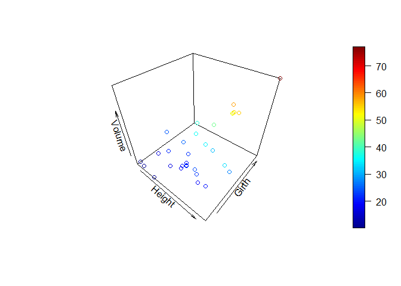

Utilizaremos los datos “trees”. Se trata de un conjunto de datos que
consta de 31 observaciones sobre mediciones de la circunferencia, altura
y volumen de la madera sobre cerezos negros talados:

-   Girth: Diámetro en pulgadas del árbol.
-   Height: Altura en pies del árbol.
-   Volume: Volumen de la madera en pies cúbicos.

Para acceder a los datos escribimos en R:

    # Activamos los datos
    data(trees)

Se desea estimar un modelo de regresión dque estime el volumen (Volume)
en función de la circunferencia del árbol (Girth) y la altura del árbol
(Height); para ello:

## Realice un análisis exploratorio y visualice la relación entre las tres variables.

Comenzamos describiendo la relación entre las variables Volume, Girth y
Height.

    # observamos las primeras 5 observaciones
    head(trees)

    ##   Girth Height Volume
    ## 1   8.3     70   10.3
    ## 2   8.6     65   10.3
    ## 3   8.8     63   10.2
    ## 4  10.5     72   16.4
    ## 5  10.7     81   18.8
    ## 6  10.8     83   19.7

    # Obtenemos las dimensiones de la base de datos
    dim(trees)

    ## [1] 31  3

Vemos que las 3 variables que vamos a analizar (Volume, Girth y Height)
son todas numéricas.

Podemos visualizar la relación entre la respuesta y los predictores
mediante 2 diagramas de dispersión. Para ello utilizamos la función
ggpairs del paquete GGally.

    # Instalamos el paquete GGally en caso de no tenerlo instalado
    #install.packages("GGally")

    # Activamos el paquete GGally
    library(GGally)

    ## Registered S3 method overwritten by 'GGally':
    ##   method from   
    ##   +.gg   ggplot2

    # Graficamos las 3 variables
    ggpairs(trees[,c("Volume", "Girth","Height")])

Vemos que exsiste una relación positiva entre los tres pares de
variables. En caso del par Volume y Girth, la correlación es mayor.

También podemos obtener un gráfico 3D con la nube de puntos mediante la
función scatter3D del paquete plot3D.

    # Instalamos el paquete plot3D en caso de no tenerlo instalado
    #install.packages("plot3D")

    # Activamos el paquete plot3D
    library(plot3D)

    # Realizamos el gráfico 3D con las 3 variables que estamos analizando
    scatter3D(x=trees$Height,
    y=trees$Girth,
    z=trees$Volume,
    xlab="Height",
    ylab="Girth",
    zlab="Volume")

## Realice un modelo de regresión múltiple por medio de la función lm() solo con efectos principales. Interprete la bondad de ajuste del modelo. Calcule la tasa de error del modelo.

Realizamos un modelo de regresión múltiple por medio de la función lm()
para las 3 variables que vamos a analizar (Volume, Girth y Height).

    # Ajustamos el modelo de regresión lineal múltiple
    model_trees <- lm(Volume~Girth+Height, data= trees)

    # Observamos los resultados
    summary(model_trees)

    ## 
    ## Call:
    ## lm(formula = Volume ~ Girth + Height, data = trees)
    ## 
    ## Residuals:
    ##     Min      1Q  Median      3Q     Max 
    ## -6.4065 -2.6493 -0.2876  2.2003  8.4847 
    ## 
    ## Coefficients:
    ##             Estimate Std. Error t value Pr(>|t|)    
    ## (Intercept) -57.9877     8.6382  -6.713 2.75e-07 ***
    ## Girth         4.7082     0.2643  17.816  < 2e-16 ***
    ## Height        0.3393     0.1302   2.607   0.0145 *  
    ## ---
    ## Signif. codes:  0 '***' 0.001 '**' 0.01 '*' 0.05 '.' 0.1 ' ' 1
    ## 
    ## Residual standard error: 3.882 on 28 degrees of freedom
    ## Multiple R-squared:  0.948,  Adjusted R-squared:  0.9442 
    ## F-statistic:   255 on 2 and 28 DF,  p-value: < 2.2e-16

Para interpretar la bondad de ajuste observamos los resultados finales
del modelo:

-   Prueba de F global: El modelo de regresión predice el volumen de
    madera significativamente bien (F (2, 28) = 255, p −value &lt;
    .001).

-   El error estándar residual (RSE) es de 3.882 pies cúbicos.

-   La tasa de error es

<!-- -->

    sigma(model_trees)/mean(trees$Volume)

    ## [1] 0.1286612

-   R2: el coeficiente de determinación ajustado (que es el que nos
    interesa) es R2= .9442, es decir,nuestro modelo (o los 2 predictores
    considerados) explican el 94.42% de la variabilidad en la respuesta.

## Interprete los coeficientes del modelo.

Obtenemos la tabla de coeficientes:

    summary(model_trees)$coefficients

    ##                Estimate Std. Error   t value     Pr(>|t|)
    ## (Intercept) -57.9876589  8.6382259 -6.712913 2.749507e-07
    ## Girth         4.7081605  0.2642646 17.816084 8.223304e-17
    ## Height        0.3392512  0.1301512  2.606594 1.449097e-02

-   El intercepto vale -57.9876589, en este caso no tiene sentido
    interpretar su valor ya que es imposible estimar el volumen de
    madera (Volume) para árboles de 0 pulgadas de circunferencia (Girth)
    y 0 pies de altura (Height). (una opción sería centrar las variables
    para que el intercepto pase a tener sentido como el volumen de
    madera para una cierta circunferencia y una cierta altura).

-   El coeficiente de regresión para el predictor Girth vale 4.7081605 y
    representa el cambio en el volumen de madera del árbol al aumentar 1
    pulgada de circunferencia (Girth), cuando la altura permanece
    constante (Height).

-   El coeficiente de regresión para el predictor Height vale 0.3392512
    y representa el cambio en el volumen de madera (Volume) al aumentar
    1 pulgada de altura (Height) manteniendo constante la circunferencia
    (Girth).

## Calcule los intervalos de confianza para los coeficientes.

    confint(model_trees)

    ##                    2.5 %      97.5 %
    ## (Intercept) -75.68226247 -40.2930554
    ## Girth         4.16683899   5.2494820
    ## Height        0.07264863   0.6058538

## Calcule la importancia relativa de los predictores.

La función *calc.relimp()* del paquete *relaimpo* calcula la importancia
relativa de los predictores con el método **LMG**. Nos da la
contribución de cada predictor al R2 (promediada según el
orden en que se ingresan los predictores).

    # Instalamos el paquete relaimpo en caso de no tenerlo instalado
    #install.packages("relaimpo")

    # Activamos el paquete
    library(relaimpo)

    # Calculamos la importancia relativa de los predictores.
    crlm <- calc.relimp(model_trees, # objeto con el modelo
    type = c("lmg"), # medida utilizada
    rela = TRUE) # para sumar 100%

    #resultados
    crlm

    ## Response variable: Volume 
    ## Total response variance: 270.2028 
    ## Analysis based on 31 observations 
    ## 
    ## 2 Regressors: 
    ## Girth Height 
    ## Proportion of variance explained by model: 94.8%
    ## Metrics are normalized to sum to 100% (rela=TRUE). 
    ## 
    ## Relative importance metrics: 
    ## 
    ##             lmg
    ## Girth  0.804561
    ## Height 0.195439
    ## 
    ## Average coefficients for different model sizes: 
    ## 
    ##              1X       2Xs
    ## Girth  5.065856 4.7081605
    ## Height 1.543350 0.3392512

Según el método LMG la variable Girth (.804561) tiene mayor importancia
relativa en el modelo respecto a Height (.195439).

## Evalué los supuestos del modelo.

Realizamos los gráficos diagnóstico del modelo.

    #gráficos diagnóstico del modelo
    par(mfrow = c(2,2))
    plot(model_trees)

Podemos indicar que:

1.  Los residuos aumentan en los extremos del rango de valores ajustados
    con lo cual no se cumpliría el supuesto de homogeneidad de varianza
    (u Homocedásticidad).
2.  ‘Normal Q-Q’. Los residuos parecen seguir una distribución normal,
    las colas no se apartan demasiado de la diagonal. Lo podemos
    comprobar con la prueba de Shapiro-Wilk.

<!-- -->

    # Prueba de normalidad de los residuos del modelo
    shapiro.test(model_trees$residuals)

    ## 
    ##  Shapiro-Wilk normality test
    ## 
    ## data:  model_trees$residuals
    ## W = 0.97431, p-value = 0.644

Comprobamos que el p-valor &gt; 0.05 por lo que no descartamos la
hipótesis nula, es decir, que los residuos siguen una distribución
normal.

1.  Lo mismo que en el punto 1.

2.  1.  ‘Residuals vs Leverage’. Aunque el valor absoluto de los
        residuos estandarizados es menor que 3, llama la atención que la
        observación de mayor diámetro supere la línea de 0.5 de la
        distancia de Cook.

## Realice un modelo de regresión con efectos de interacción entre los 2 predictores. Evalúe posibles problemas de multicolinealidad y en tal caso centre los predictores.

Ajustamos el modelo de regresión lineal múltiple con interacción:

    # Ajustamos un RLM con interacción
    model_trees2 <- lm(Volume~Girth*Height, data= trees)

Comprobamos si existe multicolinealidad de nuestras variables
predictoras.

    # Instalamos el paquete car en caso de no tenerlo instalado
    #install.packages("car")

    # Activamos el paquete
    library(car)

    # Multicolinealidad: VIF
    vif(model_trees2)

    ##        Girth       Height Girth:Height 
    ##    148.66145     15.93884    210.97302

Tenemos problemas de multicolinealidad, los V IF son &gt; 5, esto ocurre
porque las variables no están centradas y hemos incluido un término de
interacción.

Vamos a centrar las variables para eliminar los problemas de
multicolinealidad.

    # Centramos la variable Girth
    Girth2<-scale(trees$Girth,
    center=TRUE,
    scale=FALSE)

    # Centramos la variable Height
    Height2<-scale(trees$Height,
    center=TRUE,
    scale=FALSE)

    # Volvemos a ajustar un RLM con interacción con las variables centradas
    model_trees3 <- lm(trees$Volume ~ Girth2*Height2)

Volvemos a calcular el VIF.

    vif(model_trees3)

    ##         Girth2        Height2 Girth2:Height2 
    ##       1.513180       1.487784       1.126849

Ya no tenemos problemas de multicolinealidad.

------------------------------------------------------------------------

A continuación, evaluamos la significación de cada término del modelo.

    Anova(model_trees3)

    ## Anova Table (Type II tests)
    ## 
    ## Response: trees$Volume
    ##                Sum Sq Df F value    Pr(>F)    
    ## Girth2         4783.0  1 651.965 < 2.2e-16 ***
    ## Height2         102.4  1  13.956 0.0008867 ***
    ## Girth2:Height2  223.8  1  30.512 7.484e-06 ***
    ## Residuals       198.1 27                      
    ## ---
    ## Signif. codes:  0 '***' 0.001 '**' 0.01 '*' 0.05 '.' 0.1 ' ' 1

Vemos que la interacción es significativa (F (1, 27) = 30.51191, p &lt;
.001) y por tanto debe incluirse en el modelo final.

## Interprete los coeficientes del modelo.

Observamos la tabla de coeficientes e interpretamos:

    summary(model_trees3)

    ## 
    ## Call:
    ## lm(formula = trees$Volume ~ Girth2 * Height2)
    ## 
    ## Residuals:
    ##     Min      1Q  Median      3Q     Max 
    ## -6.5821 -1.0673  0.3026  1.5641  4.6649 
    ## 
    ## Coefficients:
    ##                Estimate Std. Error t value Pr(>|t|)    
    ## (Intercept)    28.81791    0.54466  52.910  < 2e-16 ***
    ## Girth2          4.37789    0.19384  22.585  < 2e-16 ***
    ## Height2         0.48687    0.09466   5.143 2.07e-05 ***
    ## Girth2:Height2  0.13465    0.02438   5.524 7.48e-06 ***
    ## ---
    ## Signif. codes:  0 '***' 0.001 '**' 0.01 '*' 0.05 '.' 0.1 ' ' 1
    ## 
    ## Residual standard error: 2.709 on 27 degrees of freedom
    ## Multiple R-squared:  0.9756, Adjusted R-squared:  0.9728 
    ## F-statistic: 359.3 on 3 and 27 DF,  p-value: < 2.2e-16

Como hemos centrado previamente las variables, interpretamos la
interacción de la siguiente manera:

-   El efecto de la circunferencia (Girth2) sobre el volumen de madera
    (Volume) aumenta en 0.13465 pies cúbicos por cada pie que aumenta la
    altura (Height2).

Por ejemplo, para una altura promedio, el volumen de madera de un cerezo
negro aumenta en 4.37789 pies cúbicos por cada pulgada extra de
circunferencia. Si la altura es un pie mayor que el promedio, el efecto
de cada pulgada extra de circunferencia pasa a ser 4.37789 + (0.13465∗1)
= 4.51254 pies cúbicos.

El modelo final es:
Volume = 28.81791 + 4.37789 ∗ Girth+0.48687∗Height+ 0.13465\*Girth:Height
